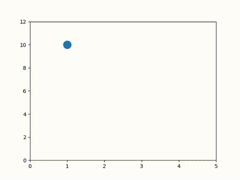

# Particle Motion Under Gravity

This project simulates the motion of a particle under gravity, with a focus on visualizing the particle's bounce and trajectory. It includes both a C++ implementation and a Python demo, as well as a sample video output.

## Features
- Simulates particle motion under gravity
- Visualizes bouncing behavior
- C++ implementation (`particle.cpp`)
- Python demo script (`demo.py`)
- Example output video (`particle_bounce.mp4`)

## Files
- `particle.cpp`: C++ source code for the simulation
- `demo.py`: Python script for running and visualizing the simulation
- `requirements.txt`: Python dependencies
- `Makefile`: Build and run commands for the project

## Getting Started

### Prerequisites
- Python 3.x
- C++ compiler (e.g., g++)


## Setup & Usage

This project uses a `Makefile` to automate setup and running:

1. **Install dependencies and set up the Python virtual environment:**
   ```bash
   make install
   ```


2. **Run the simulation and Python demo:**
   ```bash
   make run
   ```
   > This will automatically build the C++ extension if it hasn't been built yet, so running `make` separately is not required.

4. **Clean up build artifacts and the virtual environment:**
   ```bash
   make clean
   ```


## Output


The simulation output can be visualized as a video below or through the Python script's visualization:

<p align="center">
   
</p>

## License
This project is licensed under the MIT License - see the [LICENSE](LICENSE) file for details.
